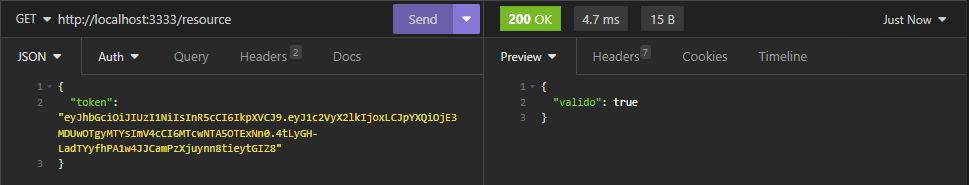

# COMO UTILIZAR ESTA API.

### Primeiramente é necessária a criação de um banco de dados nomeado como "crud". O que pode ser feito utilizando o seguinte comando em um ambiente de desenvolvimento como MySQL Workbench. 
#### É importante ressaltar que o nome do banco de dados pode ser alterado, assim como as credenciais do banco, __desde__ que sejam alteradas, também, essas informações no código da API.

```bash 
# comando SQL para criar o banco de dados:
$ CREATE DATABASE crud
```

### Após a criação do banco de dados é importante que o mesmo esteja selecionado para uso. Isso pode ser feito com o comando:

```bash
# comando SQL para selecionar o banco de dados:
$ USE crud
```

### Quanto a criação das tabelas o ORM sequelize se encarregará disso.

## Após o download do repositório: 

### Antes de iniciar a aplicação, é importante que sejam instalados os módulos *node_modules* através do terminal. Abaixo está uma lista dos módulos necessários:

* express
* jsonwebtoken
* mysql2
* nodemon
* sequelize

### Instale os módulos com o seguinte comando:

```bash 
# comando para a instalação dos módulos necessários:
$ npm install 'nome do módulo'
```
### Finalmente, viaje até a pasta backend pelo terminal e inicie a aplicação com o comando: 

```bash 
# comando para inicializar a aplicação:
$ npm start
```

## Dicas de uso

* Como o projeto contempla apenas a parte de backend, indico a utilização de softwares como insomnia ou postman para realizar requisições a API.
* O usuário deve fazer as requisições com um objeto JSON no body da requisição.
* Para realizar o cadastro e o login o usuário apenas informará as suas credenciais, porém após o login receberá um token que será necessário para todas as futuras requisições.

## Exemplo de uso

### Cadastro de usuário


### Login de usuário


### Requisição à rota /resource para verificar token


### Cadastro de dados


### Atualizar dados


### Ler os dados inseridos


### Excluir registros 
